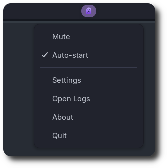

<p align="center">
  
</p>

# 👻 dingus

Per-app notification sounds for Linux.

## 📝 Summary

`dingus` is a small DBus listener that plays a custom sound whenever a notification fires, matched by the originating app name (and optionally the freedesktop notification category, e.g. `im.received`, `email.arrived`). It ships with a system tray icon for quick mute/unmute, autostart toggle, settings, log access, and quit.

Configuration lives at `~/.config/dingus/config.toml` and is auto-generated with examples on first run. Reload without restarting by sending `SIGHUP` to the running process — or just toggle the tray menu.

## ❓ Why?

I started this project because I was chasing nostalgia and wanted to use old school ICQ sounds for notifications on the various Linux desktop environments I use. Hence, this app is called dingus. Derived from the "ding" (sound play) of dingus and the fact that I feel like a pretty silly user for wanting this sort of configurability which, "What a dingus" was what we were called a lot by our parents growing up when we were being silly, odd, and most of the time, annoying. 🤪

There is a more practical reason for this utility though. Setting different notification sounds for different apps or types of apps does have productively/focus related perks. Having uniquely identifiable audio categories in notification sound helps me prioritize my focus. For example, if I can simply tell from the sound that it's not something important enough at the moment, I don't even have to move my eyes away to look at the notification at all.


## 📸 Screenshot




## 📦 Dependencies

Python **3.11+** is required (for `tomllib`), plus python-dbus, PyGObject, AyatanaAppIndicator3, and PipeWire (`pw-play`).

**Debian / Ubuntu:**

```bash
sudo apt install python3-dbus python3-gi gir1.2-ayatanaappindicator3-0.1 pipewire
```

**Fedora:**

```bash
sudo dnf install python3-dbus python3-gobject libayatana-appindicator-gtk3 pipewire
```

**Arch:**

```bash
sudo pacman -S --needed python-dbus python-gobject libayatana-appindicator pipewire
```

## 🚀 Installation

```bash
git clone https://github.com/hkdb/dingus.git
cd dingus
./install.sh
```
The installer:

- Copies `dingus.py` to `~/.local/bin/dingus`
- Installs the icon set under `~/.local/share/icons/hicolor/`
- Installs the desktop entry to `~/.local/share/applications/`
- Adds `~/.local/bin` to PATH (bash/zsh/fish)

Run with `dingus`. Toggle **Auto-start** from the tray menu to launch on login.

> **GNOME users:** install the [AppIndicator and KStatusNotifierItem Support](https://extensions.gnome.org/extension/615/appindicator-support/) extension for the tray icon to render.

To remove dingus:

```
./uninstall.sh
```

## 🛠️ Configuration

The config file lives at `~/.config/dingus/config.toml` and is created with examples on first run. Open it from the **Settings** entry in the tray menu, or edit it directly.

After saving, send `SIGHUP` to reload without restarting:

```bash
pkill -HUP dingus
```

### Top-level keys

| Key | Type | Default | Notes |
|---|---|---|---|
| `default_sound` | string | freedesktop message | Played for any mapped app that has no sound of its own. Set to `""` to play sounds only for explicitly mapped apps. |
| `rate_limit_ms` | int | `1000` | Minimum milliseconds between sounds. Prevents spammy apps from machine-gunning audio. |
| `respect_dnd` | bool | `true` | Suppress all sounds when GNOME Do-Not-Disturb is on. |

### Per-app mapping

```toml
[apps]
"Slack"        = { sound = "~/sounds/slack.oga" }
"Firefox"      = { sound = "~/sounds/firefox.oga" }
"Thunderbird"  = { mute = true }
```

The key must match the `app_name` argument from `org.freedesktop.Notifications.Notify` **or** the `application_id` from `org.gtk.Notifications.AddNotification`, **exactly** (case-sensitive). Run dingus from a terminal to see the names as notifications come in.

`mute = true` silences an app even if `default_sound` is set.

### Per-category sounds

The freedesktop notification spec passes a `category` string (e.g. `im.received`, `email.arrived`, `transfer.complete`). You can map a different sound per category within an app:

```toml
[apps]
"Slack" = { sound = "~/sounds/slack.oga", categories = { "im.received" = "~/sounds/ding.oga" } }
```

Or with the expanded TOML form for many categories:

```toml
[apps."Evolution"]
sound = "~/sounds/evolution.oga"

[apps."Evolution".categories]
"email.arrived" = "~/sounds/email.oga"
"im.received"   = "~/sounds/ding.oga"
```

**Resolution order**: app + category → app sound → `default_sound`.


## ⭐ Useful?

If you find this little utility enjoyable for you too, feel free to give the repo a star or buy me a coffee 👻:

[](https://www.buymeacoffee.com/3dfosi)


## ⚠️ Disclaimer

This is a hobby project. It targets Linux desktops running PipeWire and an SNI-aware status panel (KDE, Cinnamon, MATE, XFCE, Hyprland with `waybar`, GNOME with the AppIndicator extension). It is not tested across every distro / desktop environment combination — your mileage may vary.

The software is provided as-is, with no warranty of any kind. The author and contributors are not responsible for any issues that may arise from using it. Use at your own risk.

Distributed under the MIT License. See [`LICENSE`](LICENSE) for full terms.
